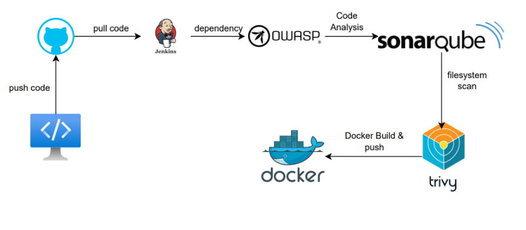
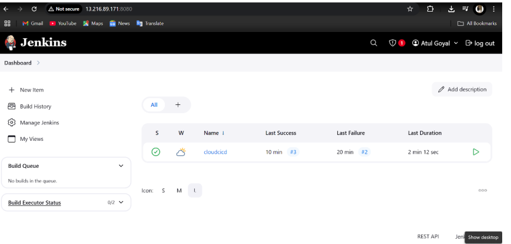
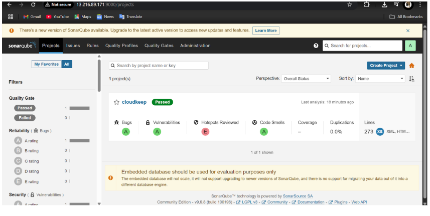
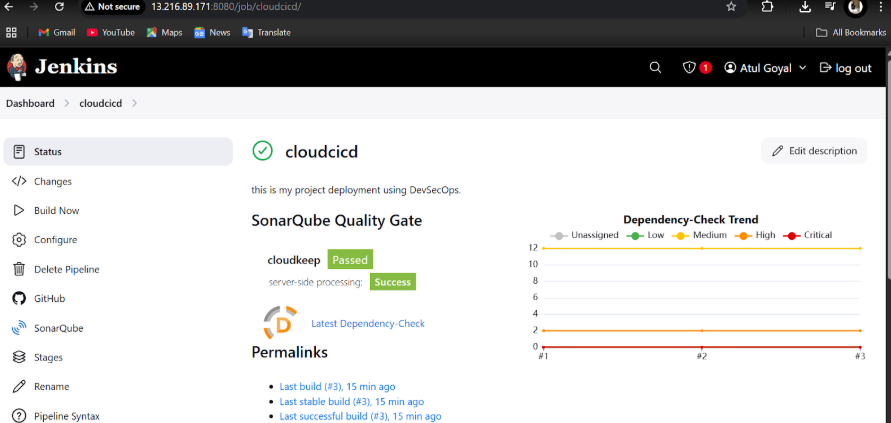

# ☁️ CloudKeep – Secure Cloud-Native File Storage


> **CloudKeep** is a secure, cloud-native web application designed as part of the **Cloud Computing Lab** to demonstrate **end-to-end DevSecOps deployment** on AWS using **Jenkins, Docker, SonarQube, Trivy, and OWASP Dependency-Check**.  
It integrates **AWS S3** for file storage, **RDS** for persistence, and enforces security with **IAM policies**.

---

## 📚 Table of Contents
- [Project Overview](#project-overview)
- [Architecture](#architecture)
- [Technologies Used](#technologies-used)
- [Methodology](#methodology)
- [CI/CD Pipeline](#cicd-pipeline)
- [Deployment](#deployment)
- [Future Scope](#future-scope)
- [Conclusion](#conclusion)

---

## 🚀 Project Overview
- CloudKeep allows users to **upload/download files securely** to **AWS S3**.  
- Persistent metadata is stored in **Amazon RDS**.  
- Hosted on **AWS EC2** with a **static Elastic IP** for global access.  
- Automated CI/CD pipeline ensures **secure and consistent deployments**.






---

## 🛠️ Technologies Used
- **Frontend**: React.js  
- **Backend**: Node.js, Express.js  
- **Database**: Amazon RDS (MySQL)  
- **Storage**: Amazon S3  
- **Infrastructure**: AWS EC2, IAM  
- **CI/CD Tools**: Jenkins, SonarQube, Docker, Trivy, OWASP Dependency-Check  

---

## 📑 Methodology

1. **AWS Setup**  
   - EC2 instance with Elastic IP for Jenkins, Docker, and app hosting.  
   - S3 for file storage, IAM for access control.  
   - RDS for persistent data storage.  

2. **Application Development**  
   - Full-stack app using **Node.js + React**.  
   - Sensitive credentials stored in `.env`.  

3. **CI/CD Pipeline with Jenkins**  
   - Clone code from GitHub  
   - Static code analysis (**SonarQube**)  
   - Security scans (**OWASP & Trivy**)  
   - Docker image build & deployment  

4. **Testing**  
   - File upload/download validation  
   - RDS data persistence check  
   - IAM permission enforcement  

---

## ⚙️ CI/CD Pipeline

**Pipeline Workflow:**

```groovy
pipeline {
  agent any

  environment {
      SONAR_HOME = tool "Sonar"
  }

  stages {
      stage("Clone Code from GitHub") {
          steps {
              git url: 'https://github.com/goyalxatul/CloudKeep.git', branch: 'main'
          }
      }

      stage("SAST - SonarQube Analysis") {
          steps {
              withSonarQubeEnv("Sonar") {
                  sh """
                      ${SONAR_HOME}/bin/sonar-scanner \
                      -Dsonar.projectName=cloudkeep \
                      -Dsonar.projectKey=cloudkeep \
                      -Dsonar.sources=.
                  """
              }
          }
      }

      stage("Quality Gate") {
          steps {
              timeout(time: 2, unit: 'MINUTES') {
                  waitForQualityGate abortPipeline: true
              }
          }
      }

      stage("OWASP Dependency Check") {
          steps {
              dependencyCheck additionalArguments: "--scan ./", odcInstallation: 'dc'
              dependencyCheckPublisher pattern: '**/dependency-check-report.xml'
          }
      }

      stage("Trivy File System Scan") {
          steps {
              sh 'trivy fs . --format table -o trivy-fs-report.html'
          }
      }

      stage("Deploy Using Docker Compose") {
          steps {
              script {
                  sh 'docker-compose up -d --build'
              }
          }
      }
  }
}
