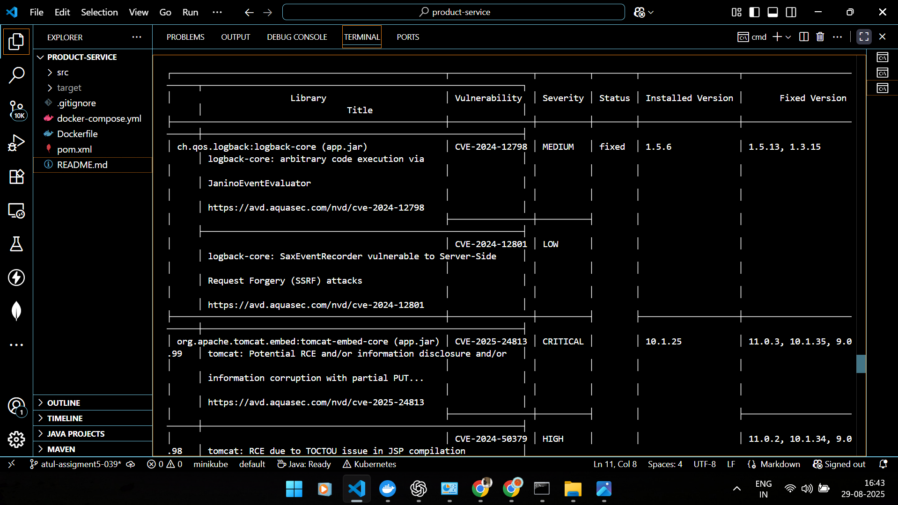

# Product Service (Spring Boot + Docker)

A minimal Spring Boot microservice for products in a retail system.

## Prerequisites
- Java 17+
- Maven 3.9+
- Docker 24+

## Run Locally
```bash
mvn spring-boot:run
```


- API root: `http://localhost:8080/api/products`
- H2 console: `http://localhost:8080/h2-console` (JDBC URL: `jdbc:h2:mem:retaildb`)

## Build JAR
```bash
mvn clean package -DskipTests
```

## Docker (multi-stage)
```bash
docker build -t product-service:1.0 .
docker run -d -p 8081:8080 --name product product-service:1.0
```

## Docker Compose
```bash
docker compose up -d
```

## Example Requests
List all:
```bash
curl http://localhost:8080/api/products
```
Create:
```bash
curl -X POST http://localhost:8080/api/products -H "Content-Type: application/json" -d '{"name":"Cap","description":"Black baseball cap","stock":30,"price":399.00}'
```

## Next Steps (for your project)
- Push image to your Docker Trusted Registry (DTR) and enable security scanning.
- Repeat this service pattern for `order-service` and `customer-service`.
- Add API gateway / service discovery if needed (Spring Cloud).
