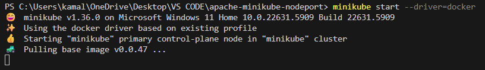

Apache on Minikube (NodePort)

How to run (PowerShell, run as Administrator if necessary):
1. Start Minikube (docker driver recommended)
   minikube start --driver=docker
   

2. From the extracted folder, create the ConfigMap, apply the deployment and service:
   kubectl create configmap apache-index --from-file=index.html=./index.html
   
3. Create ConfigMap   
   kubectl apply -f apache-deployment.yaml
   
   kubectl apply -f apache-service.yaml
   

3. Wait for the pod to be ready:
   kubectl get pods -l app=apache -o wide
   

4. Get access URL:

   minikube service apache-nodeport
   
 
