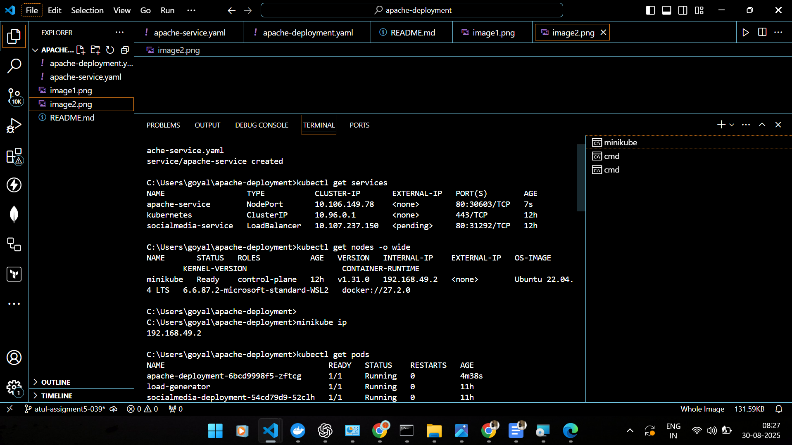

# Jenkins Distributed Pipeline (Controller–Agent Setup)

This project demonstrates a **Jenkins Controller–Agent (formerly Master–Slave) architecture** using Docker and Docker Compose. It runs a simple **Maven Java project** in a distributed pipeline:

-   **Agent1** → Compiles the project
-   **Agent2** → Runs the tests

---



## 📂 Project Structure

jenkins-distributed-pipeline/
│── docker-compose.yml
│── Jenkinsfile
│── jenkins/           # Jenkins controller Dockerfile & config
│── agent1/            # Agent1 Dockerfile (Maven + JDK)
│── agent2/            # Agent2 Dockerfile (Maven + JDK)
│── maven-project/     # Sample Java Maven project (pom.xml, src/, tests)


---

## ⚡ Prerequisites

-   Docker (v24+)
-   Docker Compose (v2+)
-   At least 2 GB free memory (for Jenkins + agents)

---

## 🚀 Setup & Run

1.  **Clone this repository**
    ```bash
    git clone <your-repo-url>
    cd jenkins-distributed-pipeline
    ```

2.  **Start Jenkins + Agents**
    ```bash
    docker compose up -d --build
    ```

3.  **Access Jenkins UI**
    Open your browser to: `http://localhost:9090`

4.  **Unlock Jenkins**
    Get the initial admin password:
    ```bash
    docker exec -it jenkins cat /var/jenkins_home/secrets/initialAdminPassword
    ```
    Paste this in the Jenkins setup page and follow the wizard to install suggested plugins.

---

## 🔧 Configure Jenkins Nodes

1.  Go to **Manage Jenkins → Nodes & Clouds → New Node**.
2.  Create a node named **agent1** with label `agent1`.
3.  Set the **Launch method** to `Launch agent via SSH`.
4.  Set the **Host** to `agent1` (the container name).
5.  Set **Credentials** using `jenkins/jenkins` (user/password defined in the Dockerfile).
6.  Repeat steps 2-5 for **agent2**, using the name `agent2` and label `agent2`.
7.  Both nodes should show as **Connected**.

---

## 📜 Pipeline (`Jenkinsfile`)

This pipeline executes the following stages:

-   **Prepare Workspace**: Copies the project code into the Jenkins workspace.
-   **Compile on Agent1**: Runs `mvn clean compile` on `agent1`.
-   **Test on Agent2**: Runs `mvn test` on `agent2` and publishes the JUnit test results.

---

## ▶️ Running the Pipeline

1.  On the Jenkins Dashboard, select **New Item → Pipeline**.
2.  Choose **Pipeline script from SCM**.
3.  Set **SCM** to `Git`.
4.  For **Repository URL**, use `/repo` (which is the locally mounted project directory).
5.  Set the **Script Path** to `Jenkinsfile`.
6.  Click **Save & Build Now** to start the pipeline.

---

## ✅ Outputs

-   **Artifacts**: Compiled `.class` files are stored and accessible within Jenkins.
-   **Test Results**: JUnit reports are visible on the Jenkins job page.
-   **Console Logs**: Detailed logs show each stage running on the respective agents.

---

## 📖 Why Controller–Agent Architecture?

-   **Scalability**: Enables multiple builds to run in parallel.
-   **Environment Isolation**: Different agents can have distinct tools or software versions.
-   **Load Distribution**: The controller manages jobs while agents handle the heavy-lifting of builds and tests.
-   **Flexibility**: Agents can be local, in the cloud, or even on Kubernetes pods.

---

## 🛑 Stop Jenkins & Agents

```bash
docker compose down