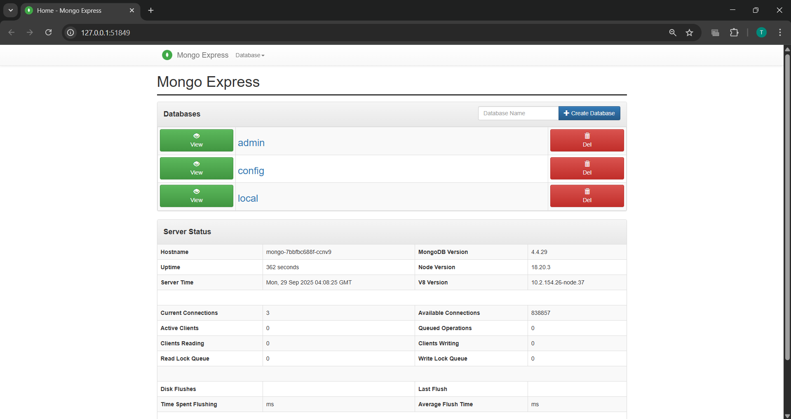
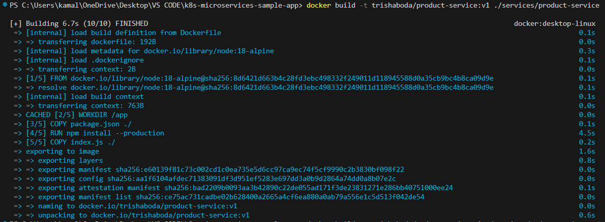
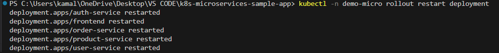

# K8s Microservices Sample App 



This project contains 4 minimal Node.js microservices + a static frontend and a single Kubernetes manifest that includes:
- Namespace, ConfigMap, Secret
- Deployments & Services for auth-service, user-service, product-service, order-service and frontend

## Quickstart (minikube)

1. Start minikube:
```bash
   minikube start --driver=docker
   ```
   

2. Build images and load into minikube (example):
 ```bash
   docker build -t trishaboda/auth-service:v1 ./services/auth-service
   docker build -t trishaboda/user-service:v1 ./services/user-service
   docker build -t trishaboda/product-service:v1 ./services/product-service
   docker build -t trishaboda/order-service:v1 ./services/order-service
   docker build -t trishaboda/frontend:v1 ./frontend
   minikube image load trishaboda/auth-service:v1
   # ...repeat for all images or push to a registry
   ```
   
   
   
   
   

3. Apply Kubernetes manifests:
```bash
   kubectl apply -f k8s/all-in-one.yaml
   kubectl -n demo-micro get all
   ```


4. Access frontend (NodePort) using:
```bash
   minikube service frontend -n demo-micro --url
   ```
   

5. Restart the Kubernetes Deployment
```bash
kubectl rollout restart deployment frontend-deploy -n microapp
 ```
 
 
6. Verify the Rollout
```bash
kubectl rollout status deployment/frontend-deploy -n microapp
 ```
 