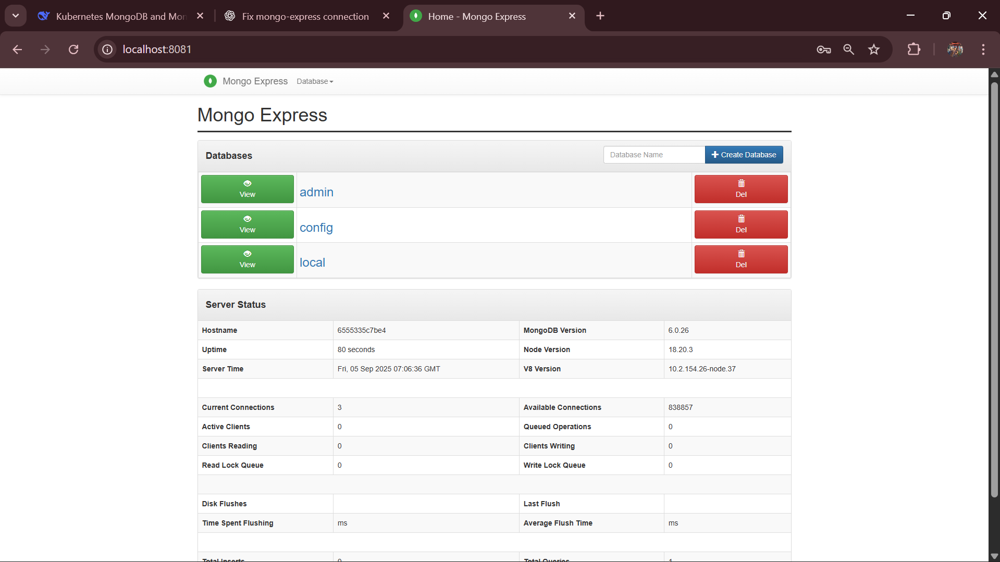
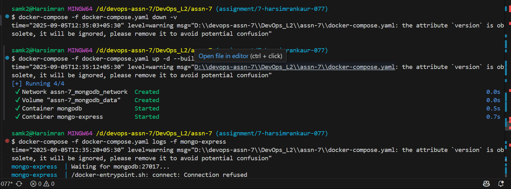

MONGO_EXPRESS_USERNAME=admin
MONGO_EXPRESS_PASSWORD=express

#docker-compose -f docker-compose.yaml up -d --build
#👉 Say: “This command builds (if needed) and starts the MongoDB and Mongo Express services in detached mode.”

#look at localhost:8081

#admin / express

#👉 Say: “Mongo Express is the web interface connected to our MongoDB container.”

#Stop everything (to show cleanup)

#docker-compose -f docker-compose.yaml down

mongo-express on 2710 
mongodb on 8081 ( but we need to access 8081)

